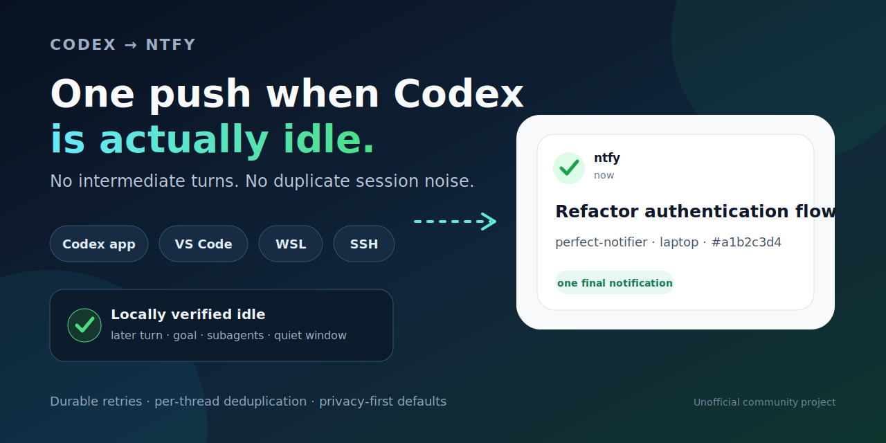

# Codex ntfy Notifier — notifiche di completamento idle-aware

[](https://github.com/ravhello/codex-ntfy-notifier/actions/workflows/ci.yml)
[](https://github.com/ravhello/codex-ntfy-notifier/releases/latest)
[](LICENSE)
[](https://www.python.org/)
[](https://learn.microsoft.com/powershell/)

[English](README.md) · [Architettura](docs/architecture.md) · [Privacy e sicurezza](docs/security-and-privacy.md) · [Supporto](SUPPORT.md) · [Alternative](docs/alternatives.md)

Una sola notifica push ntfy compatta quando una task root locale di OpenAI Codex è verificabilmente inattiva, non a ogni risultato intermedio. Funziona con app Codex, estensione VS Code, CLI, WSL e host Remote SSH.



> [!IMPORTANT]
> Questo è un progetto community non ufficiale, non affiliato né approvato da OpenAI o ntfy.

## Cosa lo distingue

- **Idle-aware:** la task root deve risultare inattiva da prove locali; turni intermedi, goal attivi e subagent ancora in esecuzione mantengono la notifica in attesa.
- **Consegna durevole:** outbox atomica, deduplicazione stabile e retry con backoff forniscono consegna at-least-once dopo la conferma di idle.
- **Multi-ambiente:** lo stesso classificatore supporta app Codex, VS Code, CLI, Windows, WSL, Linux nativo e installazioni Remote SSH locali all'host.
- **Privacy predefinita:** prompt e messaggi finali sono esclusi; titolo della task, estratto del messaggio e percorso completo richiedono ciascuno un opt-in esplicito.

## Avvio rapido

Il percorso è **installazione → `/hooks` → doctor → test**. Ogni ambiente reale Windows, WSL, Linux o SSH ha un proprio `CODEX_HOME` e deve essere installato separatamente.

Prima di installare, [sottoscrivere con un client ntfy](https://docs.ntfy.sh/subscribe/phone/) un topic difficile da indovinare oppure protetto dal [controllo accessi ntfy](https://docs.ntfy.sh/config/#access-control). Serve anche Git; Linux nativo richiede Python 3.10 o successivo.

### 1a. Installazione su Windows e WSL

Aprire PowerShell:

```powershell
git clone https://github.com/ravhello/codex-ntfy-notifier.git
cd codex-ntfy-notifier
.\install.ps1 -WslDistro Ubuntu
```

Per il solo Windows usare `.\install.ps1 -NoWsl`. Dopo l'installazione, ricaricare Codex e le finestre VS Code già aperte.

### 1b. Installazione su Linux nativo

```sh
git clone https://github.com/ravhello/codex-ntfy-notifier.git
cd codex-ntfy-notifier
CODEX_NTFY_TOPIC=$(python3 -c 'import getpass; print(getpass.getpass("Topic ntfy privato: "))')
export CODEX_NTFY_TOPIC
./install-linux.sh
unset CODEX_NTFY_TOPIC
```

### 2. Revisione dell'hook

In ogni ambiente Codex installato, eseguire `/hooks`, controllare il comando `Stop` gestito e approvarlo. L'installer non modifica mai il trust store di Codex.

### 3. Esecuzione del doctor

Windows:

```powershell
& "$HOME\.codex\notify-ntfy.ps1" -Doctor
```

Linux o WSL:

```sh
python3 ~/.codex/notify-ntfy.py --doctor
```

### 4. Invio di una notifica di test

Windows:

```powershell
& "$HOME\.codex\notify-ntfy.ps1" -Test
```

Linux o WSL:

```sh
python3 ~/.codex/notify-ntfy.py --test
```

> Se risolve un problema reale nel tuo flusso di lavoro, puoi [lasciare una stella alla repository](https://github.com/ravhello/codex-ntfy-notifier).

## Perché esiste

Una singola task Codex può produrre più segnali di fine turno mentre ha ancora lavoro: può partire subito una continuazione automatica, il goal può essere ancora `active` oppure un subagent può stare lavorando. Inviare ogni segnale crea notifiche “completato” premature.

La versione 2.4 ha introdotto il **periodo di idle logico** mantenuto dalla 2.4.2:

- l’hook moderno Codex `Stop` crea un candidato, ma non pubblica direttamente;
- la notifica legacy `agent-turn-complete` rimane come segnale di compatibilità;
- il watcher continuo dei rollout recupera completion perse dagli hook quando osserva lo stesso `CODEX_HOME`;
- ogni candidato entra prima in `pending/`;
- l’idle gate verifica che lo stesso turno sia completo, che non sia iniziato un turno successivo, che il goal non sia più attivo, che i discendenti abbiano finito e che il rollout sia rimasto quieto per una breve finestra;
- i candidati ancora pending della stessa chat root vengono consolidati: sopravvive soltanto la completion idonea più recente, mentre un’epoca già promossa nell’outbox resta immutabile;
- la modalità predefinita `strict` è fail-closed: se manca una prova locale, la notifica aspetta invece di annunciare prematuramente la fine.

Dopo la conferma di idle, il motore di consegna:

- sposta atomicamente l’evento nell’outbox prima di usare la rete;
- ritenta gli errori transitori con backoff e jitter;
- deduplica tramite `thread-id + turn-id` e riusa un `sequence_id` ntfy stabile;
- isola i record corrotti senza bloccare la coda;
- non memorizza i prompt e, per impostazione predefinita, esclude anche il messaggio finale.

La garanzia di consegna è **at-least-once durevole**, non exactly-once transazionale.

## Titolo minimo della notifica

La versione 2.4.2 mantiene la regola idle-only della 2.4 ed elimina ogni prefisso ridondante dal titolo:

```text
Titolo visibile: ✅ <task-o-progetto>
Corpo:  [messaggio finale ·] [progetto ·] origine · #thread8
```

Il campo JSON `title` contiene soltanto il titolo locale della task, oppure la directory progetto quando la condivisione del titolo è disattivata o non disponibile. Il titolo viene risolto tramite ID esatto dal database di stato Codex aperto in sola lettura e, come fallback di compatibilità, dall'indice locale delle sessioni. L'unico tag predefinito `white_check_mark` fornisce la sola emoji di completamento mostrata da ntfy: il notifier non aggiunge `Codex`, `done`, il nome del modello, uno stato testuale o altre emoji decorative. Se `include_thread_title: true` abilita un titolo locale disponibile e distinto dal progetto, il progetto passa nel corpo per non essere duplicato né perso.

Con il default `markdown: false`, il corpo occupa una sola riga e il contesto non usa etichette come `Project:`, `Source:` o `Thread:`. Con il default privacy `include_message: false` contiene soltanto il progetto necessario (quando non è già nel titolo), l'origine e `#` seguito dai primi otto caratteri dell'ID della chat. Con `include_message: true` viene anteposto un estratto redatto del messaggio finale; `max_message_chars` vale 180 per default. L'intero campo ntfy `message` ha comunque un limite rigido di 3.500 byte UTF-8. Un opt-in esplicito a Markdown può conservare le righe dell'estratto opzionale.

Le nuove installazioni usano un solo tag ntfy, `white_check_mark`. Oltre all'emoji resa da quel tag, i template non aggiungono emoji decorative nel titolo o nel corpo. Markdown è disattivato e la priorità predefinita 3 viene rappresentata omettendo `priority` dal JSON in uscita. Una priorità personalizzata diversa da 3 viene invece inviata esplicitamente.

## Ambienti supportati

| Ambiente | Segnali di completion | Worker |
| --- | --- | --- |
| Windows 10/11 | `Stop` moderno + `notify` legacy + watcher rollout | Utilità di pianificazione |
| WSL2 | segnali Linux, bridge Windows, root rollout registrata, fallback nativo | worker Windows / Python |
| Linux nativo | `Stop` moderno + `notify` legacy + watcher rollout | servizio systemd utente / on-demand |
| Remote SSH Windows/Linux | segnali e stato rollout dell’host remoto | worker sull’host remoto |

Le stesse regole valgono per task locali avviate da app Codex, VS Code o CLI quando quel processo Codex scrive hook e rollout nell’ambiente installato. Windows, ogni distribuzione WSL, Linux e ogni host SSH hanno un proprio `CODEX_HOME` e vanno configurati separatamente.

Le task interamente cloud che non replicano lo stato nel `CODEX_HOME` locale non sono garantite. Il progetto non si collega a stream privati dell’interfaccia.

Fonti ufficiali: [Codex Hooks](https://learn.chatgpt.com/docs/hooks) e [configurazione delle notifiche](https://learn.chatgpt.com/docs/config-file/config-advanced#notifications).

## Dettagli dell'installazione Windows e WSL

L'avvio rapido Windows/WSL riportato sopra chiede il topic con input nascosto su una nuova installazione. L’installer:

1. crea la configurazione privata;
2. salva un backup di rollback;
3. installa il worker `CodexNtfyWatcher`;
4. conserva o installa `notify` come fallback legacy;
5. registra `hooks.Stop` senza sostituire handler non gestiti dal progetto;
6. installa bridge e fallback nativo WSL e registra nel watcher Windows le root Codex/SQLite della distribuzione.

Per Windows senza WSL:

```powershell
.\install.ps1 -NoWsl
```

### Revisione una tantum dell’hook

Codex non esegue automaticamente un nuovo hook finché l’utente non lo ha revisionato. In ogni ambiente installato, aprire `/hooks` e approvare l’hook `Stop` gestito dopo averne controllato il comando.

L’installer non modifica intenzionalmente il trust store di Codex. Prima dell’approvazione restano attivi il fallback legacy e il watcher dei rollout; l’hook moderno è comunque il candidato di stop più tempestivo, poi classificato dal notifier come root o discendente.

## Dettagli dell'installazione Linux

Con `CODEX_NTFY_SKIP_SYSTEMD=1` si usa soltanto il worker on-demand. Il worker continuo è consigliato perché esegue il watcher che recupera i segnali mancanti.

## Host Remote SSH

Gli installer remoti copiano destinazione, autenticazione e policy private, ma azzerano `watch_roots`: i percorsi WSL/custom del computer sorgente non sono portabili. Eventuali root aggiuntive vanno configurate sulla destinazione.

Windows, da PowerShell:

```powershell
.\install-remote-windows.ps1 -HostName my-windows-host
```

Linux, da Linux o WSL:

```sh
./install-remote-linux.sh my-linux-host "$HOME/.codex/ntfy-config.json"
```

Ogni host reale mantiene `pending/`, cursori dei rollout, outbox e worker propri. Quando possibile, usare un token ntfy publish-only diverso per ciascun host. Revisionare `/hooks` anche nell’ambiente remoto.

## Configurazione

La configurazione privata è `~/.codex/ntfy-config.json`; vedere [ntfy-config.example.json](ntfy-config.example.json).

### Rilevamento idle

| Impostazione | Default | Significato |
| --- | ---: | --- |
| `idle_detection_mode` | `"strict"` | `strict` aspetta una prova completa; `balanced` può usare il fallback temporale; `off` torna alla coda immediata per turno. |
| `idle_grace_seconds` | `1.5` | Quiet time richiesto dopo la completion corrispondente. |
| `idle_probe_grace_seconds` | `30` | Attesa prima del fallback di `balanced`; non indebolisce `strict`. |
| `goal_aware` | `true` | Trattiene il candidato finché il goal root è `active`. |
| `goal_poll_seconds` | `1` | Intervallo di ricontrollo di goal, turno e discendenti. |
| `subagent_orphan_seconds` | `1800` | Età dopo la quale un rollout figlio fermo non blocca per sempre. |
| `suppress_technical_turns` | `true` | Sopprime completion legacy/watcher non rivolte all’utente; un `Stop` classificato come root resta candidato. |
| `watch_rollouts` | `true` | Recupera completion persistite localmente ma perse dagli hook. |
| `watch_scan_seconds` | `2` | Frequenza di scansione del worker continuo. |
| `watch_discovery_seconds` | `60` | Frequenza della discovery ricorsiva limitata dei rollout recenti in directory vecchie o archiviate; i cursor esistenti sono sempre seguiti. |
| `watch_initial_replay_seconds` | `15` | Alla prima osservazione recupera solo una coda del rollout molto recente. |
| `watch_roots` | `[]` | Root Codex aggiuntive osservate dal worker Windows; `install.ps1` gestisce quelle delle distribuzioni WSL selezionate, con root SQLite e origine. |
| `worker_sqlite_path` | gestito dall'installer | Root SQLite locale usata dal watcher pianificato Windows se diversa da `CODEX_HOME`; gli installer remoti la reimpostano sulla destinazione. |

Usare `strict` quando evitare falsi “finito” è la priorità. `balanced` privilegia la disponibilità dopo 30 secondi anche con prove incomplete e può quindi produrre un falso positivo. `off` è una modalità di compatibilità/diagnostica.

### Privacy e consegna

- `include_message: false`: non conserva né invia il messaggio finale;
- `max_message_chars: 180`: limita l'estratto finale opzionale; il corpo completo resta comunque limitato a 3.500 byte UTF-8;
- `include_thread_title: false`: non usa il titolo della task, che può riassumere il prompt;
- `include_full_path: false`: non aggiunge al corpo il percorso di lavoro completo sanitizzato;
- `tags: ["white_check_mark"]`: usa un solo tag ntfy senza duplicare un'emoji nel testo;
- `priority: 3`: usa la priorità ntfy predefinita e omette il campo dal JSON in uscita;
- `markdown: false`: invia il corpo compatto come testo semplice;
- `suppress_subagents: true`: non invia completion dei discendenti;
- `max_attempts: 0`: retry illimitati per errori transitori;
- `sent_retention_days: 14` e `dead_retention_days: 30`: retention di receipt e dead-letter;
- `allow_insecure_auth: false`: vieta credenziali su HTTP non locale.

Con `include_message: true`, il messaggio finale viene redatto e troncato, ma la redazione regex è solo best-effort. I prompt utente non vengono salvati.

`include_message` viene verificato di nuovo al momento dell'invio. Disattivarlo impedisce che il contenuto finale presente in record già accodati lasci l'host, ma non cancella il record locale, i backup, le dead letter, una richiesta già in corso o una notifica già accettata da ntfy. `include_full_path: true` resta un opt-in separato che può esporre il percorso di lavoro sanitizzato.

L’idle gate legge metadati locali e campi SQLite in sola lettura. Interroga lo **stato** del goal, non il suo obiettivo. Il watcher conserva path, offset, timestamp e ID della chat, non il contenuto dei prompt.

## Diagnostica

Windows:

```powershell
& "$HOME\.codex\notify-ntfy.ps1" -Doctor
Get-ScheduledTask CodexNtfyWatcher | Select-Object TaskName, State
```

Linux/WSL:

```sh
python3 ~/.codex/notify-ntfy.py --doctor
systemctl --user status codex-ntfy.service
```

Nel doctor:

- `pending_idle` indica i candidati che aspettano ancora la prova di idle;
- `queued` indica gli eventi già pronti per la rete;
- `watched_rollouts` indica i cursori persistiti dal recovery watcher;
- `idle_detection_mode`, `goal_aware` e `watch_rollouts` mostrano la policy attiva.

Stato locale:

```text
~/.codex/ntfy-state/
  pending/      candidati in attesa dell’idle gate
  outbox/       eventi idle in attesa di ntfy
  watch/        cursori incrementali dei rollout
  sent/         receipt di consegna
  suppressed/   receipt subagent/tecniche/superate
  dead/         record invalidi o falliti definitivamente
  notify.log    log operativo limitato
```

Non cancellare `pending/` o `outbox/` durante un problema normale. Consultare [Risoluzione problemi](docs/troubleshooting.md).

## Limiti noti

- Gli hook moderni richiedono approvazione esplicita tramite `/hooks`.
- `strict` può lasciare in attesa una vera completion se Codex non conserva più le prove locali necessarie.
- `balanced` può notificare con prova incompleta dopo il grace period.
- I formati rollout e gli schemi SQLite locali appartengono a Codex e possono cambiare.
- Un figlio abbandonato smette di bloccare dopo `subagent_orphan_seconds`.
- Le task solo cloud non sono garantite senza stato locale.
- Il recovery autonomo richiede un worker continuo. L'installer Windows registra solo le distribuzioni passate a `-WslDistro`; le altre non vengono scandite implicitamente.
- La consegna è at-least-once dopo la conferma idle, non exactly-once.

## Alternative

Esistono notifier più piccoli e strumenti multi-agent/multi-provider. Questa repo è focalizzata su tre proprietà insieme: prova di idle della chat root, consegna ntfy durevole e topologia multi-host. Vedere [Alternative e progetti adiacenti](docs/alternatives.md).

## Test

La suite usa soltanto un server HTTP locale finto e non contatta un topic ntfy reale:

```sh
python3 -m unittest discover -s tests -v
```

## Sicurezza

Leggere [Privacy e sicurezza](docs/security-and-privacy.md) e segnalare vulnerabilità in privato come descritto in [SECURITY.md](SECURITY.md).

## Licenza

[MIT](LICENSE) © 2026 Riccardo Ravello e contributors.
