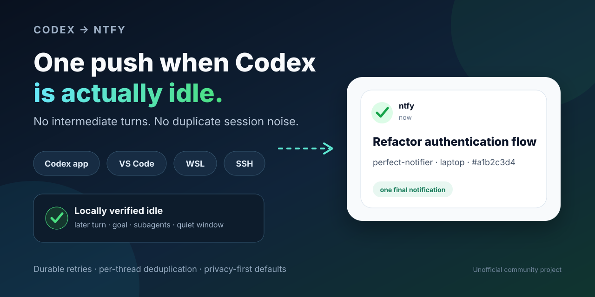

# Know when your coding task is actually idle

Codex ntfy Notifier provides final-only completion alerts for supported local coding
chats, plus a separate exact-once AudnCode intervention alert for a verified
unanswered root `AskUserQuestion`, across Windows, WSL, Linux, and host-local Remote SSH installs. Intermediate
signals stay behind a provider-specific idle gate, while a durable outbox retries
transient delivery failures. Codex tasks can run in the Codex app, VS Code, or CLI
and can optionally link to their authenticated ChatGPT task page; ordinary ChatGPT
chats without mirrored local Codex state are outside the observation boundary.

Version 2.5 also connects local Claude Code on Windows—including Claude
Desktop's Code tab—through managed lifecycle hooks and a transcript-backed
`/goal` finality gate, while reusing the same durable queue. A manual goal clear
is discarded rather than announced as a completion.

Version 2.6 adds AudnCode on Windows. A normal `Stop` is only a candidate and
needs a later matching `idle_prompt`. A `StopFailure` is terminal only when one
matching transcript error is proven for the current prompt; it bypasses that
idle event, not the host-runtime, queue, background, team, task, cron, settling,
or pre-commit gates. Per-session epochs and hook-process ordering keep
concurrent windows and delayed events isolated, while runtime state survives
`/clear` and `/resume`.

[View the repository](https://github.com/ravhello/codex-ntfy-notifier) ·
[Install the latest release](https://github.com/ravhello/codex-ntfy-notifier/releases/latest) ·
[Quick start](https://github.com/ravhello/codex-ntfy-notifier#quick-start)

## Built for real Codex setups

- Codex app, VS Code extension, and CLI
- opt-in Claude Code on Windows (Desktop Code tab, CLI, and VS Code)
- opt-in AudnCode on Windows
- Windows, WSL2, native Linux, and Remote SSH hosts
- concurrent tasks, automatic continuations, active goals, and delegated agents
- temporary network failures, with a persistent outbox and capped retry backoff
- compact notification titles and privacy-preserving defaults

Each installed environment needs access to its own local lifecycle state.
Pure cloud tasks that never mirror supported state locally are not guaranteed. The
delivery model is durable at-least-once after idle confirmation, not
transactional exactly-once.

## Quick start

Windows with an optional Ubuntu WSL installation:

```powershell
git clone https://github.com/ravhello/codex-ntfy-notifier.git
cd codex-ntfy-notifier
.\install.ps1 -WslDistro Ubuntu
```

Add `-EnableClaudeCode`, `-EnableAudnCode`, or both to that command. Each opt-in
merges its managed handlers without replacing existing user hooks:

```powershell
.\install.ps1 -WslDistro Ubuntu -EnableClaudeCode -EnableAudnCode
```

AudnCode hook shape 9 uses seven synchronous 60-second events: `SessionStart`,
`UserPromptSubmit`, `Stop`, `StopFailure`, `Notification`, `PostToolUse`, and
`SubagentStart`. `SessionStart` matches `^(startup|resume|clear)$`, `Notification`
matches `^(idle_prompt|permission_prompt)$`, and `PostToolUse` matches exactly
`^(Agent|AskUserQuestion|Bash|PowerShell|Monitor|TaskStop|KillShell|CronCreate|CronDelete|SendMessage)$`.
`permission_prompt` is a separate exact-once intervention signal only for one
unanswered root `AskUserQuestion`; it is never a completion. Managed launchers
may also declare a private per-attempt recovery marker so recovered provider
errors stay silent and only definitive exhaustion can notify.
Each command supplies a trusted expected event; ingress is armed before strict
UTF-8 input is read, with an 8 MiB cap. A 1,000 ms idle threshold feeds a gate
with a minimum 1.25-second settle and repeated pre-commit checks. Queue,
background, team/task, CCR, and causal cron lease/file evidence is bounded and
fails closed when missing, malformed, unstable, ambiguous, or oversized.
Close AudnCode before a hook-changing install, then reopen it when the installer
creates or rotates the observation marker. Hooks execute only in a workspace
AudnCode already trusts. Distinct `CLAUDE_CONFIG_DIR` profiles are installed
separately and remain isolated by AudnCode home.

Native Linux:

```sh
git clone https://github.com/ravhello/codex-ntfy-notifier.git
cd codex-ntfy-notifier
CODEX_NTFY_TOPIC=$(python3 -c 'import getpass; print(getpass.getpass("Private ntfy topic: "))')
export CODEX_NTFY_TOPIC
./install-linux.sh
unset CODEX_NTFY_TOPIC
```

Read the complete [installation and privacy guidance](https://github.com/ravhello/codex-ntfy-notifier#quick-start)
before using a real topic. Newly installed Codex hooks require explicit review
through `/hooks`.

## How it stays quiet and reliable

Completion signals become candidates rather than immediate notifications. The
provider-specific idle gate checks the matching turn or session, later work,
goal state, active descendants, and the required final-idle evidence. Eligible events then move atomically into a host-local
outbox, where one worker retries transient failures and deduplicates stable
thread-and-turn identities.

The visible notification title stays compact: one ntfy status emoji plus the
conversation title, or the privacy-preserving project fallback. It contains no
provider/model prefix, `done` word, lifecycle label, or duplicate emoji.

[Architecture](architecture.md) ·
[Privacy and security](security-and-privacy.md) ·
[Troubleshooting](troubleshooting.md) ·
[Alternatives](alternatives.md) ·
[Contributing](https://github.com/ravhello/codex-ntfy-notifier/blob/main/CONTRIBUTING.md)

> This is an unofficial community project. It is not affiliated with or
> endorsed by OpenAI, Anthropic, AudnCode, or ntfy.
